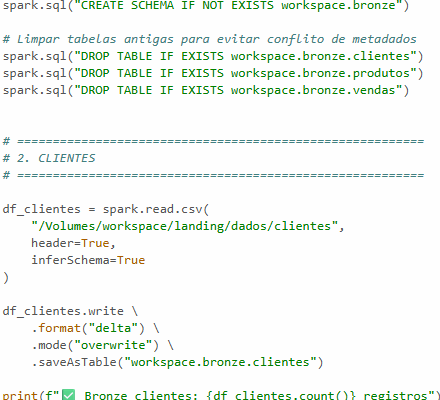
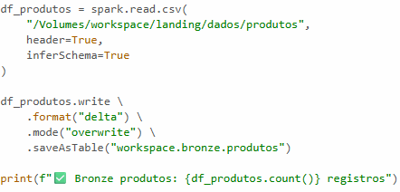

# Bronze Layer

## Conversão para Delta Lake

Após a etapa de extração, os arquivos CSV ou JSON armazenados na camada Landing foram lidos utilizando notebooks no Databricks. O principal objetivo dessa etapa foi converter os dados brutos para o formato Delta Lake, criando assim a camada Bronze do pipeline Medalhão.

O Delta Lake oferece diversas vantagens em relação aos formatos tradicionais de armazenamento. Entre elas estão suporte a transações ACID, versionamento de dados, melhor desempenho em consultas e maior confiabilidade durante operações de leitura e escrita. Essas características tornam o processamento mais robusto e adequado para ambientes corporativos.

Durante essa etapa, os dados foram organizados em um novo schema chamado BRONZE. Embora os dados ainda sejam considerados brutos, agora eles estão armazenados em um formato otimizado para processamento distribuído dentro do Databricks. Essa camada também serve como base para futuras transformações e validações.

A camada Bronze possui um papel fundamental na arquitetura Medalhão, pois representa a transição entre os dados originais e o ambiente de processamento analítico. Ela permite que os dados sejam armazenados de forma eficiente e preparados para os tratamentos aplicados posteriormente na camada Silver.

Logo abaixo, estará o Schema da camada Bronze, onde ele está puxando os dados da camada anterior, ou seja, a Landing.

Com os produtos, acontece a mesma coisa que os clientes: o Bronze puxa os dados do Landing.

