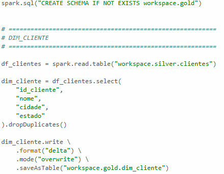
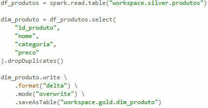

# Gold Layer

## Modelagem Dimensional

A camada Gold representa o estágio final do pipeline de dados. Nessa etapa, os dados da camada Silver foram utilizados para alimentar tabelas dimensionais seguindo os conceitos de modelagem dimensional propostos por Ralph Kimball. O objetivo dessa camada é disponibilizar dados organizados para análise estratégica e geração de indicadores.

A modelagem dimensional facilita consultas analíticas e melhora o desempenho em ferramentas de Business Intelligence. Nesse modelo, os dados são organizados em tabelas fato e dimensão, permitindo análises mais rápidas e intuitivas. Essa abordagem é amplamente utilizada em Data Warehouses modernos.

Os dados modelados foram armazenados em um schema chamado GOLD. Diferente das etapas anteriores, essa camada já contém informações refinadas e estruturadas especificamente para consumo analítico. Isso significa que usuários finais, dashboards e relatórios podem acessar dados mais limpos, consistentes e organizados.

A camada Gold também evidencia a importância da separação de responsabilidades dentro da arquitetura Medalhão. Enquanto Landing, Bronze e Silver possuem foco operacional e técnico, a Gold é voltada diretamente para geração de valor através da análise dos dados. Essa divisão torna o pipeline mais eficiente e alinhado às necessidades do negócio.

Os dados da tabela de produtos também passam por um processo semelhante de limpeza e padronização, preparando as informações para as próximas etapas do pipeline.

