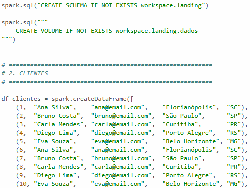
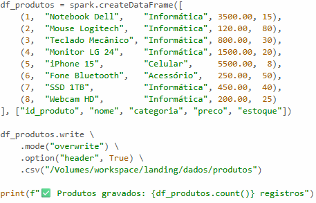

# Landing Layer

## Extração e Armazenamento Inicial

A camada Landing representa o primeiro estágio do pipeline de dados. Nessa etapa, os dados foram extraídos de um banco de dados relacional ou não relacional, dependendo da escolha realizada para o projeto. O objetivo principal dessa camada é armazenar os dados em seu formato original, preservando todas as informações vindas da origem sem qualquer transformação inicial.

Para bancos relacionais, os dados foram exportados no formato CSV, enquanto bancos não relacionais utilizaram o formato JSON. Essa separação foi importante para manter compatibilidade com diferentes tipos de estruturas de dados. Os arquivos gerados foram armazenados em um schema específico dentro do Databricks chamado LANDING/DADOS.

A camada Landing funciona como uma zona de aterrissagem dos dados, servindo como ponto inicial para todas as etapas seguintes do pipeline. Manter os dados brutos disponíveis permite realizar auditorias, reprocessamentos e validações futuras sem necessidade de acessar novamente a fonte original. Isso também contribui para maior segurança e rastreabilidade.

Outro ponto importante dessa etapa foi garantir que a extração contemplasse todas as tabelas do banco escolhido. Dessa forma, o pipeline consegue representar de maneira mais completa os dados disponíveis, preparando o ambiente para as etapas de ingestão e transformação realizadas posteriormente.

Logo abaixo, estará o Schema juntamente com alguns dados de exemplo (ao todo, são 40 dados), onde está o Id, nome, email, a cidade e por fim, seu estado.

Já aqui, temos a gravação dos produtos, que contam com os seguintes campos: Id, nome do produto, a sua categoria, o preço e por fim, quantos itens há no estoque.

